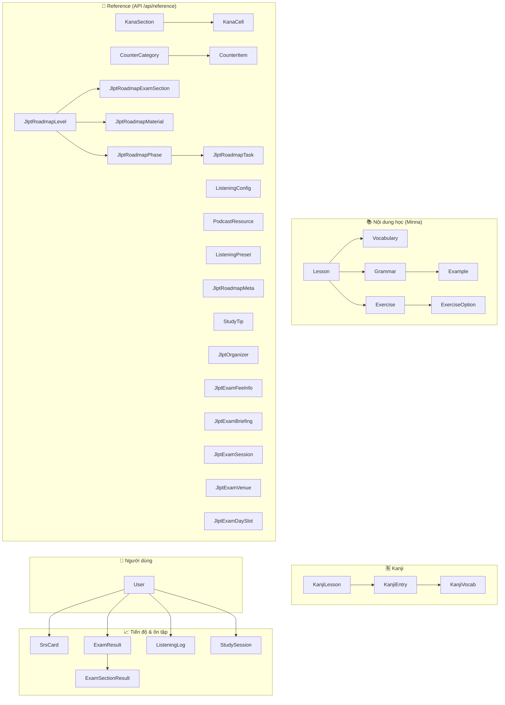

# Sơ đồ Database — NIHONGO APP

PostgreSQL · Prisma schema: `backend/prisma/schema.prisma`

## Tổng quan 6 nhóm

> **Lưu ý:** `SrsCard` trỏ tới vocab/grammar/kanji qua `(contentType, contentId)` — không có FK cứng.

---

## ER Diagram chi tiết

Xem preview: **Ctrl + Shift + V** (hoặc **Ctrl + K**, **V** để mở cạnh editor).

```mermaid
erDiagram

%% ═══ MINNA CONTENT ═══════════════════════════════

    Lesson {
        int     id PK
        int     lessonNumber UK
        string  title
        string  description
        enum    jlptLevel
        string  thumbnailUrl
        datetime createdAt
        datetime updatedAt
    }

    Vocabulary {
        int     id PK
        int     lessonId FK
        string  kanji
        string  kana
        string  romaji
        string  meaning
        string  meaningEn
        string  partOfSpeech
        enum    jlptLevel
        string  pitchAccent
        string  audioUrl
        int     frequencyRank
    }

    Grammar {
        int     id PK
        int     lessonId FK
        string  pattern
        string  meaning
        string  explanation
        enum    jlptLevel
        string  formalityLevel
    }

    Example {
        int     id PK
        int     grammarId FK
        string  jp
        string  romaji
        string  en
        string  vi
        string  audioUrl
    }

    Exercise {
        int     id PK
        int     lessonId FK
        enum    type
        string  question
        string  answer
        string  explanation
        string  audioUrl
        int     difficulty
    }

    ExerciseOption {
        int     id PK
        int     exerciseId FK
        string  text
        int     sortOrder
    }

%% ═══ KANJI ═══════════════════════════════════════

    KanjiLesson {
        int     id PK
        int     lessonNumber UK
        string  title
        enum    jlptLevel
    }

    KanjiEntry {
        int     id PK
        int     lessonId FK
        string  character
        string  hanViet
        string  onyomi
        string  kunyomi
        string  meaningVi
        string  meaningEn
        string  mnemonicJp
        string  mnemonicVi
        string  imageUrl
        enum    jlptLevel
        int     strokeCount
        int     frequency
        int     grade
        int     sortOrder
    }

    KanjiVocab {
        int     id PK
        int     kanjiEntryId FK
        string  word
        string  reading
        string  meaningVi
    }

%% ═══ KANA CHARTS ═════════════════════════════════

    KanaSection {
        int     id PK
        enum    script
        string  slug
        string  title
        string  subtitle
        int     columns
        int     sortOrder
    }

    KanaCell {
        int     id PK
        int     sectionId FK
        int     rowIndex
        int     colIndex
        string  kana
        string  romaji
    }

%% ═══ COUNTERS ════════════════════════════════════

    CounterCategory {
        int     id PK
        string  slug UK
        string  label
        string  hint
        int     sortOrder
    }

    CounterItem {
        int     id PK
        int     categoryId FK
        string  displayNumber
        string  kanji
        string  kana
        string  romaji
        string  meaningVi
        int     sortOrder
    }

%% ═══ DAILY LISTENING ═════════════════════════════

    ListeningConfig {
        int     id PK
        int     goalMinutes
    }

    PodcastResource {
        int     id PK
        string  externalKey UK
        string  title
        string  description
        string  url
        string  level
        int     sortOrder
    }

    ListeningPreset {
        int     id PK
        string  externalKey UK
        string  label
        int     lessonFrom
        int     lessonTo
        int     sortOrder
    }

%% ═══ JLPT ĐÀ NẴNG ════════════════════════════════

    JlptOrganizer {
        int     id PK
        string  name
        string  shortName
        string  address
        string  phone
        string  email
        string  website
        string  announcementsUrl
    }

    JlptExamFeeInfo {
        int     id PK
        string  formFee
        string  examFee
        string  note
    }

    JlptExamBriefing {
        int     id PK
        string  text
    }

    JlptExamSession {
        int     id PK
        string  externalKey UK
        string  label
        string  examDate
        string  registrationPeriod
        enum    status
        string  statusLabel
        string  announcementUrl
        int     sortOrder
    }

    JlptExamVenue {
        int     id PK
        string  address
        string  district
        string  levels
        string  note
        int     sortOrder
    }

    JlptExamDaySlot {
        int     id PK
        string  levels
        string  arriveAt
        string  startAt
        string  venue
        int     sortOrder
    }

%% ═══ JLPT ROADMAP ════════════════════════════════

    JlptRoadmapMeta {
        int     id PK
        string  examScheduleNote
    }

    StudyTip {
        int     id PK
        string  text
        int     sortOrder
    }

    JlptRoadmapLevel {
        int     id PK
        string  externalKey UK
        string  label
        string  badge
        string  color
        string  duration
        string  vocabTarget
        string  kanjiTarget
        string  passScore
        string  summary
        int     sortOrder
    }

    JlptRoadmapExamSection {
        int     id PK
        int     levelId FK
        string  name
        int     points
        string  time
        int     sortOrder
    }

    JlptRoadmapMaterial {
        int     id PK
        int     levelId FK
        string  title
        string  description
        string  scope
        string  inAppPath
        string  inAppLabel
        string  externalUrl
        string  externalLabel
        int     sortOrder
    }

    JlptRoadmapPhase {
        int     id PK
        int     levelId FK
        string  externalKey
        string  title
        string  subtitle
        int     sortOrder
    }

    JlptRoadmapTask {
        int     id PK
        int     phaseId FK
        string  externalKey
        string  text
        string  inAppPath
        string  inAppLabel
        string  externalUrl
        string  externalLabel
        int     sortOrder
    }

%% ═══ USER & PROGRESS ═════════════════════════════

    User {
        int     id PK
        string  email UK
        string  passwordHash
        enum    role
        string  name
        string  avatarUrl
        string  nativeLanguage
        enum    targetJlptLevel
        int     studyGoalMinutes
        int     totalStudySeconds
        datetime lastActiveAt
    }

    SrsCard {
        int     id PK
        int     userId FK
        enum    contentType
        int     contentId
        string  kana
        string  kanji
        string  meaning
        int     lessonNumber
        float   easeFactor
        int     interval
        int     repetitions
        datetime nextReviewAt
        datetime lastReviewedAt
        int     wrongCount
        int     correctCount
        int     reviewStreak
        bool    mastered
    }

    ExamResult {
        int     id PK
        int     userId FK
        string  examId
        string  level
        string  title
        int     correctCount
        int     total
        float   percent
        bool    passed
        datetime submittedAt
    }

    ExamSectionResult {
        int     id PK
        int     examResultId FK
        string  section
        int     correct
        int     total
        float   percent
    }

    ListeningLog {
        int     id PK
        int     userId FK
        date    date
        int     seconds
        int     lessonFrom
        int     lessonTo
    }

    StudySession {
        int     id PK
        int     userId FK
        date    date
        int     seconds
        int     cardsReviewed
    }

%% ═══ RELATIONSHIPS ═══════════════════════════════

    Lesson              ||--o{ Vocabulary              : has
    Lesson              ||--o{ Grammar                 : has
    Lesson              ||--o{ Exercise                : has
    Grammar             ||--o{ Example                 : has
    Exercise            ||--o{ ExerciseOption          : has

    KanjiLesson         ||--o{ KanjiEntry              : has
    KanjiEntry          ||--o{ KanjiVocab              : has

    KanaSection         ||--o{ KanaCell                : has

    CounterCategory     ||--o{ CounterItem             : has

    JlptRoadmapLevel    ||--o{ JlptRoadmapExamSection  : has
    JlptRoadmapLevel    ||--o{ JlptRoadmapMaterial     : has
    JlptRoadmapLevel    ||--o{ JlptRoadmapPhase        : has
    JlptRoadmapPhase    ||--o{ JlptRoadmapTask          : has

    User                ||--o{ SrsCard                 : reviews
    User                ||--o{ ExamResult              : takes
    User                ||--o{ ListeningLog            : logs
    User                ||--o{ StudySession            : studies
    ExamResult          ||--o{ ExamSectionResult       : has
```

---

## Bảng tra cứu nhanh

| Nhóm | Bảng | Mục đích |
|------|------|----------|
| Minna | `Lesson`, `Vocabulary`, `Grammar`, `Example`, `Exercise`, `ExerciseOption` | Nội dung bài học 1–50 |
| Kanji | `KanjiLesson`, `KanjiEntry`, `KanjiVocab` | Bộ kanji theo bài |
| Reference | `KanaSection`, `KanaCell`, `CounterCategory`, `CounterItem`, … | Dữ liệu tĩnh qua `/api/reference/:slug` |
| JLPT | `JlptRoadmap*`, `JlptExam*`, `JlptOrganizer`, `StudyTip` | Lộ trình & lịch thi |
| User | `User` | Đăng nhập, profile |
| Progress | `SrsCard`, `ExamResult`, `ListeningLog`, `StudySession` | Ôn tập SM-2, mock exam, nghe mỗi ngày |

## Enums

| Enum | Giá trị |
|------|---------|
| `Role` | `USER`, `ADMIN` |
| `JlptLevel` | `N5` … `N1` |
| `ExerciseType` | `MULTIPLE_CHOICE`, `FILL_IN_BLANK`, `LISTENING` |
| `ContentType` | `VOCABULARY`, `GRAMMAR`, `KANJI` |
| `KanaScript` | `HIRAGANA`, `KATAKANA` |
| `JlptSessionStatus` | `REGISTRATION_OPEN`, `REGISTRATION_CLOSED`, `UPCOMING`, `PAST` |
