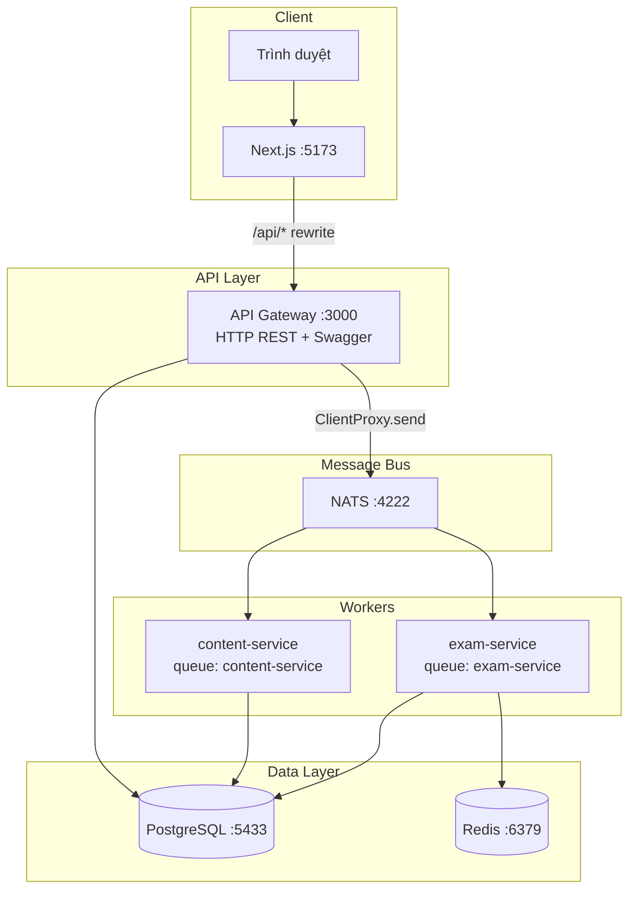
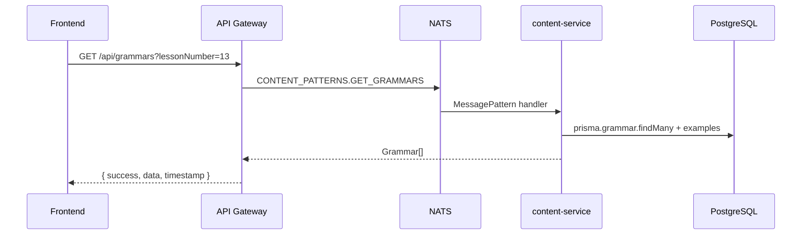
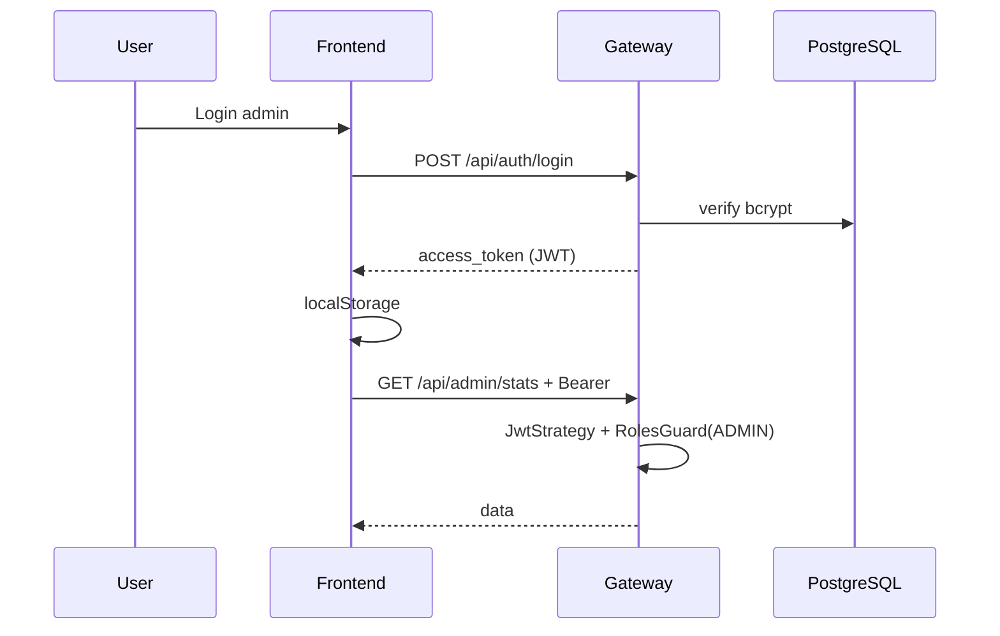

# Phân tích thiết kế hệ thống — NIHONGO APP

> Tài liệu mô tả kiến trúc, thành phần, luồng dữ liệu và các quyết định thiết kế của ứng dụng học tiếng Nhật (Minna no Nihongo, JLPT, mock exam).
>
> **Liên quan:** [Sơ đồ database](./db-diagram.md) · Swagger: `http://localhost:3000/api/docs`

---

## 1. Tổng quan

### 1.1 Mục tiêu

| Mục tiêu | Mô tả |
|----------|--------|
| Học nội dung Minna | Từ vựng, ngữ pháp, bài tập theo 50 bài |
| Ôn tập & nghe | SRS từ sai, nghe mỗi ngày, phát âm TTS |
| Kanji & kana | Bảng kana, kanji theo bài, stroke order |
| JLPT | Lộ trình, lịch thi Đà Nẵng, thi thử N5/N4 |
| Quản trị | Admin import từ vựng, thống kê |

### 1.2 Đối tượng sử dụng

- **Học viên:** Dùng app không bắt buộc đăng nhập; tiến độ ôn từ sai lưu local, đồng bộ server khi có tài khoản.
- **Admin:** Đăng nhập JWT, role `ADMIN`, quản lý nội dung và import.

### 1.3 Cấu trúc repository

```
NIHONGO-APP/
├── frontend/          # Next.js 15 (App Router) — port 5173
├── backend/           # NestJS monorepo — gateway 3000 + 2 microservice NATS
│   ├── apps/          # api-gateway, content-service, exam-service
│   ├── libs/          # common, contracts, prisma
│   └── prisma/        # schema, seed, data bundles
├── docs/              # Tài liệu kỹ thuật
├── backups/           # PostgreSQL dumps
└── docker-compose.yml
```

Hai app **độc lập** (không có root `package.json`); backend là **NestJS monorepo** (`nest-cli.json`).

---

## 2. Kiến trúc tổng thể

### 2.1 Sơ đồ triển khai



### 2.2 Mô hình kiến trúc

| Khía cạnh | Lựa chọn |
|-----------|----------|
| Frontend | SPA/SSR hybrid — Next.js App Router, client components cho tương tác |
| Backend | **API Gateway + microservice nhẹ** qua NATS (không phải microservice độc lập hoàn toàn) |
| Database | **Một PostgreSQL** dùng chung — Prisma ORM |
| Cache | Redis — session mock exam (TTL 3 giờ) |
| Giao tiếp sync | HTTP (client ↔ gateway); NATS request/response (gateway ↔ workers) |

**Lý do tách content / exam:** Content đọc nhiều, CRUD ổn định; exam cần Redis, chấm điểm, ghi kết quả — tách process giảm ảnh hưởng lẫn nhau khi scale.

### 2.3 Luồng request điển hình



Envelope response chuẩn:

```json
{
  "success": true,
  "data": { ... },
  "timestamp": "2026-06-25T..."
}
```

---

## 3. Tech stack

### 3.1 Backend

| Công nghệ | Phiên bản | Vai trò |
|-----------|-----------|---------|
| NestJS | 11.x | Framework, DI, modules |
| Prisma | 6.4 | ORM, migrations, type-safe queries |
| PostgreSQL | 16 | Database chính |
| NATS | 2.x | Message broker giữa gateway và workers |
| Redis | 7 | Cache mock exam session |
| Passport JWT | — | Xác thực |
| Swagger | — | API docs tại `/api/docs` |
| Helmet + Throttler | — | Security headers, rate limit 120 req/phút |

### 3.2 Frontend

| Công nghệ | Phiên bản | Vai trò |
|-----------|-----------|---------|
| Next.js | 15.5 | App Router, rewrite `/api` |
| React | 19 | UI |
| TanStack Query | 5.x | Server state, cache 5 phút |
| hanzi-writer | 3.x | Stroke order kanji |
| Vitest | 3.x | Unit test utils/components |

### 3.3 Hạ tầng

- **Docker Compose:** `postgres`, `nats`, `redis`, `api-gateway`, `content-service`, `exam-service`, `frontend`
- **Dev local:** Chạy infra bằng Docker, app bằng `npm run start:*` / `npm run dev`

---

## 4. Thiết kế backend

### 4.1 API Gateway (`apps/api-gateway`)

**Vai trò:** Cổng HTTP duy nhất; auth; proxy NATS; một số logic local.

| Module | Trách nhiệm |
|--------|-------------|
| `AuthModule` | Register, login, JWT, `/api/auth/me` |
| `HttpModule` | Controllers proxy → content/exam service |
| `AdminModule` | Stats, users, import (role ADMIN) |
| `JlptScheduleController` | Scrape lịch thi JLPT Đà Nẵng (UFL) |
| `HealthModule` | `/health` — DB + microservices |
| `MicroservicesModule` | `ClientProxy` `CONTENT_SERVICE`, `EXAM_SERVICE` |

**Cross-cutting:**

- `JwtAuthGuard` global — route public dùng `@Public()`
- `ResponseInterceptor` — bọc `{ success, data, timestamp }`
- `ValidationPipe` — whitelist + transform DTO
- CORS theo `ALLOWED_ORIGINS`

### 4.2 Content Service (`apps/content-service`)

Chỉ lắng nghe NATS (`ContentMsController`). Không expose HTTP.

| Module | Domain |
|--------|--------|
| `LessonsModule` | Bài học (`lessonNumber` unique) |
| `VocabulariesModule` | Từ vựng, phân trang |
| `GrammarsModule` | Ngữ pháp + `Example` (jp, romaji, vi) |
| `ExercisesModule` | Quiz + `ExerciseOption` |
| `KanjiModule` | Kanji lesson / entry / vocab |
| `ListeningModule` | Playlist nghe từ vocab + grammar examples |
| `ImportModule` | Import vocab TSV |
| `ReferenceModule` | Dữ liệu tĩnh: kana, counters, JLPT, daily listening |

**NATS patterns:** `libs/contracts/src/message-patterns.ts` → `CONTENT_PATTERNS`.

### 4.3 Exam Service (`apps/exam-service`)

| Module | Domain |
|--------|--------|
| `MockExamsModule` | Tạo đề N5/N4, session Redis, chấm điểm, `ExamResult` |
| `ProgressModule` | SRS review bank sync, `ListeningLog` |

**Redis key:** `mock-exam:{examId}`, TTL 3 giờ.

**NATS patterns:** `EXAM_PATTERNS`, `PROGRESS_PATTERNS`, event `exam.submitted`.

### 4.4 Shared libraries

| Lib | Nội dung |
|-----|----------|
| `@app/contracts` | Message patterns, DTOs (create/update lesson, vocab, …) |
| `@app/common` | Guards, decorators (`@Public`, `@Roles`), interceptors, filters, utils JP |
| `@app/prisma` | `PrismaService`, `SrsCardRepository`, export enums |

---

## 5. Thiết kế frontend

### 5.1 Routing (App Router)

| Route | Chức năng |
|-------|-----------|
| `/` | Trang chủ |
| `/vocab`, `/grammar`, `/quiz` | Minna theo bài |
| `/vocab-review` | Ôn từ hay sai (localStorage + sync API) |
| `/kana`, `/pronunciation` | Kana & phát âm |
| `/kanji` | Kanji + stroke order |
| `/counters` | Đếm số tiếng Nhật |
| `/daily-listening` | Nghe mỗi ngày |
| `/jlpt` | Lộ trình + lịch Đà Nẵng |
| `/mock-exam` | Thi thử N5/N4 |
| `/admin/*` | Dashboard admin |

### 5.2 Data layer

```
views/*.tsx
    ↓ hooks/queries.ts (React Query)
    ↓ api/index.ts (typed functions)
    ↓ lib/api-client.ts (fetch + Bearer + unwrap envelope)
    ↓ Next.js rewrite /api/* → API Gateway :3000
```

- **Query keys:** tập trung trong `hooks/queries.ts`
- **Stale time:** 5 phút (auth 1 phút)
- **Auth:** `AuthContext` + `localStorage` token `nihongo-auth-token`

### 5.3 Tách presentation / data

- **Reference content** (kana, counters, JLPT roadmap): fetch từ `/api/reference/:slug`, không còn bundle JSON trong `frontend/src/data`
- **Minna content:** fetch theo `lessonNumber` từ API grammars/vocab/exercises

---

## 6. Thiết kế database

Chi tiết ER diagram: **[db-diagram.md](./db-diagram.md)**.

### 6.1 Nhóm domain

| Nhóm | Bảng chính | Ghi chú |
|------|------------|---------|
| Minna | `Lesson`, `Vocabulary`, `Grammar`, `Example`, `Exercise`, `ExerciseOption` | `lessonNumber` là business key |
| Kanji | `KanjiLesson`, `KanjiEntry`, `KanjiVocab` | Tách khỏi Minna lesson |
| Reference | `KanaSection`/`KanaCell`, `CounterCategory`/`CounterItem`, JLPT*, listening* | Seed từ `prisma/data/reference/*.json` |
| User | `User` | Role USER \| ADMIN |
| Progress | `SrsCard`, `ExamResult`, `ExamSectionResult`, `ListeningLog`, `StudySession` | SM-2 ready trên `SrsCard` |

### 6.2 Quyết định chuẩn hóa (không JSON blob)

| Trước | Sau |
|-------|-----|
| `Exercise.options` Json | Bảng `ExerciseOption` (text, sortOrder) |
| `ExamResult.sectionScores` Json | Bảng `ExamSectionResult` |
| Reference trong `frontend/src/data` | Bảng quan hệ + API `/api/reference` |
| Ví dụ nhúng trong `grammar.explanation` | Bảng `Example` (tách trong DB) |

### 6.3 SRS — `SrsCard`

- Tham chiếu nội dung qua `(contentType, contentId)` — **không FK cứng** (polymorphic)
- Snapshot `kana`, `kanji`, `meaning`, `lessonNumber` để hiển thị nhanh
- Trường SM-2: `easeFactor`, `interval`, `repetitions`, `nextReviewAt` — sẵn sàng mở rộng thuật toán

### 6.4 Seed & backup

| Script | Mục đích |
|--------|----------|
| `seed-minna.ts` | Vocab, grammar, exercise từ `data/minna-bundle.json` |
| `seed-reference.ts` | Reference slugs từ `data/reference/*.json` |
| `seed-kll.ts` | Kanji lessons |
| `backups/*.sql` | Snapshot PostgreSQL để restore |

---

## 7. API & hợp đồng

### 7.1 REST (Gateway)

Prefix: `/api` (trừ `/health`).

| Nhóm | Endpoint mẫu | Auth |
|------|----------------|------|
| Auth | `POST /auth/register`, `POST /auth/login`, `GET /auth/me` | Public / JWT |
| Content | `GET /lessons`, `/vocabularies`, `/grammars`, `/exercises` | GET public |
| Kanji | `GET /kanji-lessons`, `/kanji` | Public |
| Reference | `GET /reference`, `/reference/:slug` | Public |
| Listening | `GET /listening/playlist` | Public |
| Mock exam | `GET /mock-exams`, `POST /mock-exams/:level/start`, `POST .../submit` | Optional JWT on submit |
| Progress | `POST/GET /progress/review`, `/progress/listening` | JWT |
| Admin | `GET /admin/stats`, `POST /admin/import/vocab` | JWT + ADMIN |
| JLPT live | `GET /jlpt/da-nang/schedule` | Public (scrape) |

### 7.2 NATS (nội bộ)

Gateway gọi `firstValueFrom(client.send(PATTERN, payload))`. Pattern định nghĩa tập trung trong `@app/contracts` — đảm bảo gateway và worker đồng bộ tên message.

### 7.3 Reference slugs

`kana-charts` · `japanese-counters` · `daily-listening` · `jlpt-roadmap` · `jlpt-danang-schedule`

---

## 8. Bảo mật & xác thực



| Cơ chế | Chi tiết |
|--------|----------|
| JWT | Payload `{ sub, email, role }`, secret `JWT_SECRET`, expiry mặc định 7 ngày |
| Admin bootstrap | `AuthService.onModuleInit` tạo admin từ env `ADMIN_EMAIL` / `ADMIN_PASSWORD` |
| Public learning | GET nội dung học không cần token |
| Rate limit | Throttler 120 request/phút/IP |
| Helmet | CSP, headers bảo mật |

---

## 9. Luồng nghiệp vụ chính

### 9.1 Học ngữ pháp bài N

1. User chọn bài → `GET /api/grammars?lessonNumber=N`
2. Response: `pattern`, `meaning`, `explanation`, `examples[]`
3. UI hiển thị từng mục; nút 🔊 gọi TTS từ `example.jp`

### 9.2 Thi thử mock exam

1. `POST /api/mock-exams/n5/start` → exam-service tạo câu hỏi từ DB, lưu session Redis
2. User làm bài → `POST /api/mock-exams/:examId/submit`
3. Chấm điểm, ghi `ExamResult` + `ExamSectionResult`; xóa session Redis

### 9.3 Ôn từ sai (vocab review)

1. Client lưu mistake trong `localStorage` (`mistakeVocab.ts`)
2. Khi có token: sync `POST /api/progress/review` → `SrsCard` upsert
3. Hiển thị stroke order qua `hanzi-writer` khi có kanji

### 9.4 Reference (kana charts)

1. `GET /api/reference/kana-charts`
2. `ReferenceService` assemble từ `KanaSection` + `KanaCell`
3. Frontend render bảng hiragana/katakana

---

## 10. Triển khai & vận hành

### 10.1 Docker Compose

```bash
docker compose up -d    # full stack
```

| Service | Port host | Ghi chú |
|---------|-----------|---------|
| frontend | 5173 | `API_URL=http://api-gateway:3000` |
| api-gateway | 3000 | Swagger `/api/docs` |
| postgres | 5433 | user/pass/db: `nihongo` |
| nats | 4222 | |
| redis | 6379 | |

### 10.2 Dev local

```bash
# 1. Hạ tầng
docker compose up -d postgres nats redis

# 2. Backend (3 terminal)
cd backend
npm run start:dev        # api-gateway
npm run start:content    # content-service
npm run start:exam       # exam-service

# 3. Frontend
cd frontend && npm run dev

# 4. Seed (lần đầu)
cd backend
npx prisma migrate deploy
npm run seed:reference
npm run seed:minna
```

### 10.3 Health check

`GET http://localhost:3000/health` → `{ status, services: { database, content, exam } }`

### 10.4 Biến môi trường quan trọng

| Biến | Service | Mô tả |
|------|---------|--------|
| `DATABASE_URL` | backend | PostgreSQL connection |
| `NATS_URL` | gateway, workers | `nats://localhost:4222` |
| `REDIS_URL` | exam-service | Mock exam cache |
| `JWT_SECRET` | gateway | Ký JWT |
| `ALLOWED_ORIGINS` | gateway | CORS |
| `API_URL` | frontend | Rewrite proxy target |

---

## 11. Trade-offs & hạn chế hiện tại

| Quyết định | Lợi | Đổi lại |
|------------|-----|---------|
| Shared PostgreSQL | Đơn giản ops, join dễ | Coupling giữa services |
| NATS RPC | Tách process, scale worker | Thêm hop latency, debug phức tạp hơn monolith |
| Public GET content | Trải nghiệm học không rào | Cần rate limit, không leak admin |
| localStorage review | Hoạt động offline-ish | Đồng bộ đa thiết bị phụ thuộc login |
| JLPT Đà Nẵng scrape | Dữ liệu mới | Phụ thuộc site ngoài; có static fallback |
| Một DB backup trong git | Dễ restore demo | File lớn (~1MB+), không thay migration |

---

## 12. Hướng phát triển gợi ý

1. **SRS đầy đủ SM-2** — tính `nextReviewAt` trên server, API review queue
2. **Migration chính thức** — thay `db push` bằng `migrate dev` có version control
3. **Tách DB** — content DB vs user/progress DB khi scale
4. **CI/CD** — lint, test, build Docker trên GitHub Actions
5. **i18n UI** — hiện UI tiếng Việt, data JP/VI
6. **Audio thật** — `audioUrl` trên Example/Vocabulary thay TTS browser

---

## Phụ lục A — Cây module backend (rút gọn)

```
api-gateway
├── auth/
├── http/          → lessons, vocab, grammar, exercises, kanji, reference, mock-exams, progress, import, jlpt
├── admin/
├── health/
└── microservices/ → NATS clients

content-service
├── lessons, vocabularies, grammars, exercises, kanji
├── listening, import, reference
└── content.ms.controller

exam-service
├── mock-exams, progress
└── exam.ms.controller
```

## Phụ lục B — Tài liệu liên quan

- [db-diagram.md](./db-diagram.md) — ER diagram Mermaid
- `backend/prisma/schema.prisma` — source of truth schema
- `http://localhost:3000/api/docs` — OpenAPI runtime

---

*Tài liệu đồng bộ với codebase tại commit chứa `docs/system-design.md`. Cập nhật khi schema hoặc kiến trúc thay đổi.*
